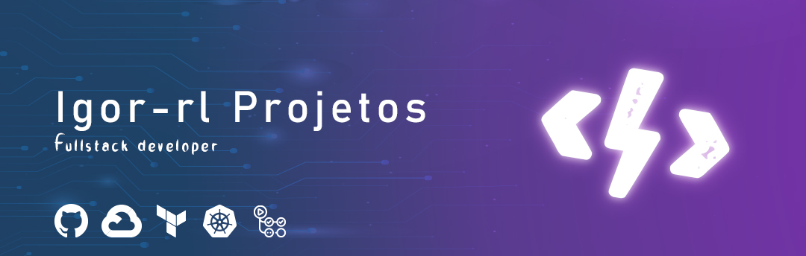

# FullCycle Imersão 17 - Desafio 2 - Criando aplicação Server Side Rendering com Next.js

## Instalar dependencias
Execute o comando abaixo para instalar as dependências da aplicação:

```
yarn
```

## Testes da aplicação
Execute o comando abaixo:

```
yarn dev
```

A aplicação estará disponível em [http://localhost:3000](http://localhost:3000).


## Detalhes do desafio
Neste desafio você precisa criar uma aplicação Next.js com uma página que liste os posts do endereço `https://jsonplaceholder.typicode.com/posts`.

A estilização precisa ser feita com o Material UI, utilize sua criatividade para listar os posts de maneira elegante. Na listagem deve ter apenas o título do post.

Ao clicar em um item da listagem precisamos ser redirecionado para uma página que mostre o título e o conteúdo do post escolha.

Disponibilize a aplicação em um repositório Git que permita-se roda-la em http://localhost:3000 ao fazer os comandos npm install e npm run dev


##

<div align="center">

[](https://github.com/igor-rl) 


</div>